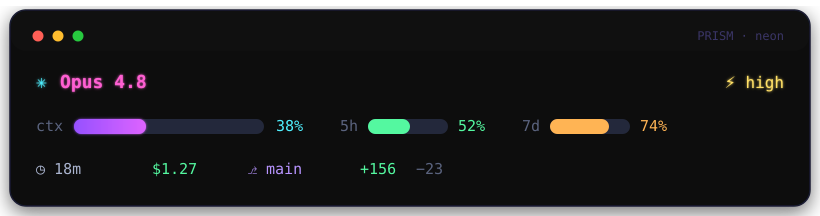

<div align="center">

# ✳ PRISM

### A colorful HUD status line for Claude Code

Model · reasoning effort · context window · 5h/7d rate limits · session cost · git — rendered as a glowing, gradient‑lit heads‑up display right in your terminal.

[](LICENSE)




</div>

---

PRISM turns Claude Code's [status line](https://code.claude.com/docs/en/statusline) into a proper **dashboard**. It reads the session JSON Claude Code pipes to it and paints a multi‑line, color‑coded panel — a purple gradient context bar, threshold‑aware rate‑limit meters, and your model, effort, cost, branch and line counts at a glance.

It's a single **zero‑dependency** Node.js file, inspired by the lovely [METRICC](https://github.com/professionalcrastinationco/METRICC) but built to be flashier and simpler: PRISM reads rate limits straight from Claude Code's native JSON, so there's no OAuth scraping — just one script.

## ✨ Features

- 🎛️ **HUD dashboard layout** — a framed, multi‑line panel that actually looks designed.
- 🟣 **Gradient context bar** — smooth per‑character truecolor (purple → magenta). Pick solid `block` bars or sleek thin `line` bars; rounded pill caps in Nerd Font mode.
- 🚦 **Threshold colors** — every metric shifts green → amber → red as it fills.
- 🎨 **Three themes** — `neon` (default), `spectrum`, `mono` — plus fully tunable palettes.
- 📊 **16 toggleable stats** — context, 5h/7d limits, cost, session, git, tokens, cache %, PR, and more.
- 🔤 **Nerd Font aware** — crisp powerline/logo glyphs when available, graceful Unicode/ASCII fallback.
- 📐 **Width‑aware** — collapses to a tidy one‑liner on narrow terminals instead of clipping.
- 🪶 **Zero dependencies, zero telemetry** — one file, Node ≥ 18, nothing phones home.
- 🛟 **Never breaks your prompt** — tolerant of missing/null fields; falls back rather than crashing.

## 🚀 Install

**Windows (PowerShell):**

```powershell
irm https://raw.githubusercontent.com/anupm-sinha/PRISM/main/install.ps1 | iex
```

**macOS / Linux / Git Bash:**

```bash
curl -fsSL https://raw.githubusercontent.com/anupm-sinha/PRISM/main/install.sh | bash
```

The installer drops `prism.mjs` into `~/.claude/prism/` and points your `statusLine` at it (your `settings.json` is backed up first). **Restart Claude Code** and you're done.

<details>
<summary><b>Manual install</b></summary>

```bash
mkdir -p ~/.claude/prism
curl -fsSL https://raw.githubusercontent.com/anupm-sinha/PRISM/main/prism.mjs -o ~/.claude/prism/prism.mjs
curl -fsSL https://raw.githubusercontent.com/anupm-sinha/PRISM/main/prism.config.jsonc -o ~/.claude/prism/prism.config.jsonc

# Wire it into Claude Code (edits ~/.claude/settings.json, with a backup):
node ~/.claude/prism/prism.mjs --install
```

Or add this to `~/.claude/settings.json` yourself (use forward slashes, even on Windows):

```json
{
  "statusLine": {
    "type": "command",
    "command": "node \"/Users/you/.claude/prism/prism.mjs\"",
    "padding": 1
  }
}
```

Remove it any time with `node ~/.claude/prism/prism.mjs --uninstall`.
</details>

## 🎨 Themes

See all three with sample data — no install required:

```bash
node prism.mjs --demo
```

| Theme | Vibe |
|-------|------|
| `neon` | Dark canvas, glowing accents, purple gradient — the default. |
| `spectrum` | Balanced multi‑color (violet / cyan / green / amber). |
| `mono` | Muted greys with a single accent — quiet and refined. |

Set your theme in `prism.config.jsonc`:

```jsonc
{ "theme": "neon" }
```

## 📊 What it shows

Default loadout is **on**; everything else is a one‑line toggle in `prism.config.jsonc`.

| Stat | Default | Description |
|------|:------:|-------------|
| `model` | ✅ | Model name, e.g. `Opus 4.8` |
| `effort` | ✅ | Reasoning effort (`low`…`max`) |
| `context` | ✅ | Context‑window gradient bar + % |
| `fiveHour` / `sevenDay` | ✅ | 5h & 7d rate‑limit meters + % |
| `session` | ✅ | Session duration |
| `cost` | ✅ | Estimated session cost (USD) |
| `branch` | ✅ | Current git branch |
| `lines` | ✅ | `+added` / `−removed` lines |
| `fiveHourReset` / `sevenDayReset` | ✅ | Countdown to limit reset |
| `tokens` | ✅ | Input tokens in context |
| `cache` | ✅ | Prompt‑cache hit % |
| `apiTime` | ⬜ | Time spent awaiting the API |
| `directory` | ⬜ | Current directory name |
| `version` | ⬜ | Claude Code version |
| `pr` | ⬜ | Open PR number + review state |
| `thinking` | ⬜ | Marker when extended thinking is on |

## ⚙️ Configuration

PRISM looks for `prism.config.jsonc` next to the script, then in `~/.claude/prism/`, then the current directory (or `$PRISM_CONFIG`). It's **JSONC** (comments + trailing commas welcome) and **hot‑reloads** — changes apply on the next refresh. Every field is optional.

```jsonc
{
  "theme": "neon",            // neon | spectrum | mono
  "glyphs": "auto",           // auto | nerd | unicode | ascii
  "barStyle": "block",        // block (solid █) | line (sleek thin ━)
  "spacing": 5,               // gap between info groups
  "minWidth": 60,             // min panel width (no tiny box on first load)
  "barWidth": 16,             // context bar width
  "smallBarWidth": 6,         // 5h / 7d bar width
  "thresholds":     { "warn": 70, "crit": 90 },  // context %
  "rateThresholds": { "warn": 60, "crit": 80 },  // rate-limit %
  "stats": { "pr": true, "tokens": true /* … */ }
}
```

## 🔤 Nerd Fonts

PRISM defaults to plain Unicode so it looks right everywhere. If you run a [Nerd Font](https://www.nerdfonts.com/), opt into crisp powerline/logo glyphs:

```jsonc
{ "glyphs": "nerd" }
```

…or set `PRISM_GLYPHS=nerd` in your environment. No special font? `auto` and `unicode` have you covered; `ascii` is there for the strictest terminals.

## 🛠️ How it works

Claude Code runs your status‑line command after each turn and pipes [session JSON](https://code.claude.com/docs/en/statusline#available-data) to it on stdin. PRISM parses that, extracts what it needs, and prints the HUD to stdout. It runs locally, costs no tokens, and reads everything (context, `rate_limits`, `effort`, cost, …) from that single payload.

Test it by hand:

```bash
echo '{"model":{"id":"claude-opus-4-8"},"context_window":{"used_percentage":38}}' | node prism.mjs
```

## 🩺 Troubleshooting

- **Boxes/▯ instead of icons** — set `"glyphs": "unicode"` (or `"ascii"`); only `"nerd"` needs a Nerd Font.
- **Status line is blank** — make sure Node is on your `PATH`, and run the command manually to see errors. PRISM never exits non‑zero on bad input.
- **Right edge looks 1 char off** — a terminal that renders `⚡` as single‑width; switch to a Nerd Font (`"glyphs": "nerd"`) for pixel‑exact frames.
- **No rate‑limit bars** — `rate_limits` only appears for Claude Pro/Max after the first response in a session.

## 🙏 Credits

Design‑first inspiration from [**METRICC**](https://github.com/professionalcrastinationco/METRICC) by professionalcrastinationco. Built for [Claude Code](https://claude.com/claude-code).

## 📄 License

[MIT](LICENSE) © 2026 Anup Mohan
